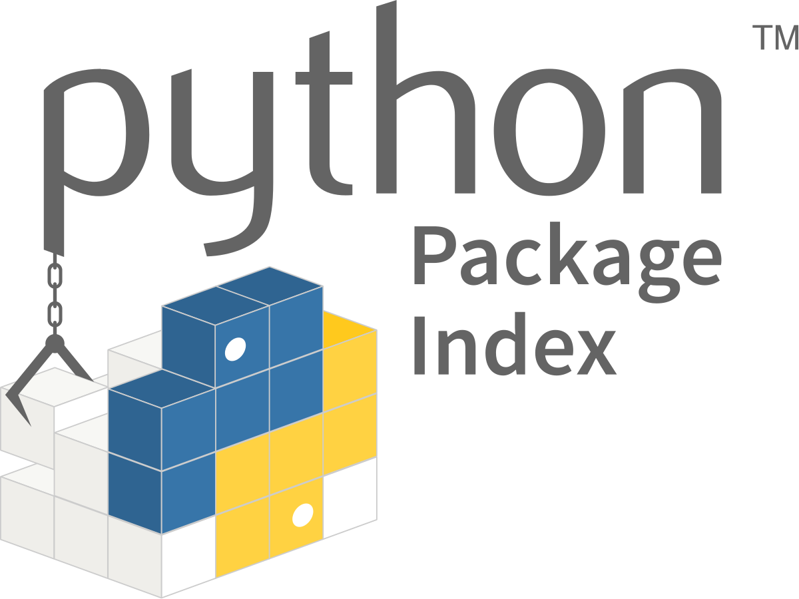

<h1 align="center"><b> Steam Game Recommender </b></h1>

## Tabla de contenidos  <!-- omit in toc -->
- [Descripción](#descripción)
- [Objetivos](#objetivos)
- [Stack tecnológico](#stack-tecnológico)
- [Archivos](#archivos)
- [Demo](#demo)
- [Acceso a la API](#acceso-a-la-api)
- [Contacto](#contacto)

## Descripción
En este proyecto se desarrolló un sistema de recomendación de juegos para la plataforma STEAM. Para ello, se utilizaron bases de datos obtenidas de la misma plataforma, se realizó un proceso de ETL, se llevó a cabo un análisis descriptivo de los datos y se utilizaron como fuente para la construcción de un modelo de aprendizaje automático. Finalmente, este trabajo se puso a disposición a través de una REST API y se implementó mediante un servicio web.

## Objetivos
* Realizar un proceso de `ETL` (Extraer, Transformar y Cargar) de los datos.
* Llevar a cabo un análisis exploratorio de los datos (`EDA`).
* Realizar un `análisis de sentimientos` de las reseñas de los usuarios.
* Implementar y desplegar una `API` capaz de responder a solicitudes GET.
* Construir un `modelo de aprendizaje automático` como sistema de recomendación.

## Stack tecnológico
El proyecto se desarrolló en Python, utilizando archivos con extensiones .py y .ipynb. Algunas de las bibliotecas destacadas incluyen:

| Librería | Uso |
|:---:|---|
|   | Operaciones con Series y DataFrames |
|   | Graficación de datos |
|  | Procesamiento de datos y aprendizaje automático |
|  | Análisis de sentimientos |
|  (wordcloud/langdetect)| Operaciones sobre texto |
|   | Montado de la API |

Adicionalmente se utilizó el servicio [__render.com__](https://render.com/) para el despliegue de la API.

## Archivos
Los principales archivos de este repositorio son:
* <a href="Diccionario de Datos STEAM.xlsx" download="Diccionario de Datos STEAM.xlsx">Diccionario de Datos STEAM.xlsx</a>: Contiene información sobre la estructura de los 3 archivos de origen (no incluidos en el repositorio).
* [ETL.ipynb](ETL.ipynb): ETL de los 3 archivos de origen, junto con un EDA de los mismos.
* [API.ipynb](API.ipynb): Archivo donde se generan los archivos de consulta de la API.
* [RS.ipynb](RS.ipynb): Desarrollo del sistema de recomendación.
* [Datasets_API](Datasets_API/): Carpeta con los archivos de consulta de la API.
* [main.py](main.py): Funciones de la API.
* [assets](assets/): Imágenes del README.

Se sugiere consultarlos en el orden en el que son presentados.

## Demo
Puedes ver una demostración del proyecto en este [video](https://youtu.be/zsVhxv65iCk). El video muestra el esquema general de trabajo y cómo realizar consultas a la API.

## Acceso a la API
Para acceder a la API y realizar consultas, visita este [enlace](https://pi-mlops-4j8c.onrender.com/docs). Ten en cuenta que, al estar en una capa gratuita, el servicio puede tardar unos minutos en estar disponible.

## Contacto
Para más información o para contactarme, puedes encontrarme en [LinkedIn](https://www.linkedin.com/in/sebastian-drajlin/).